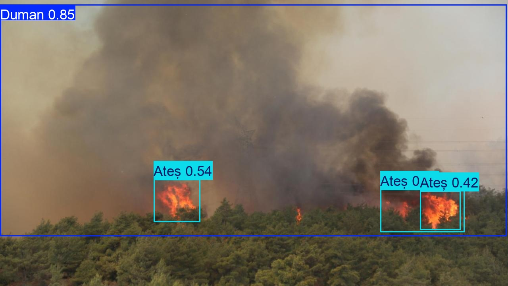
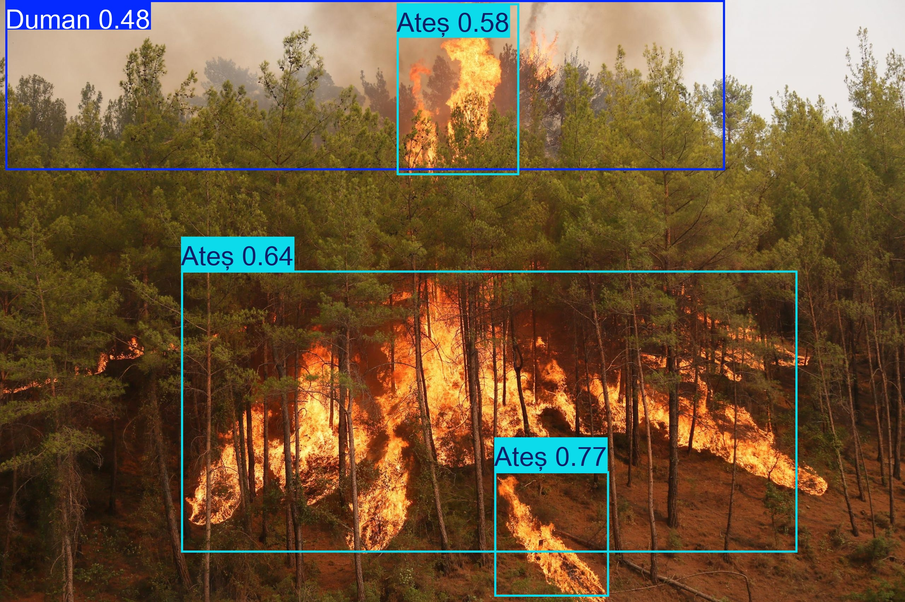
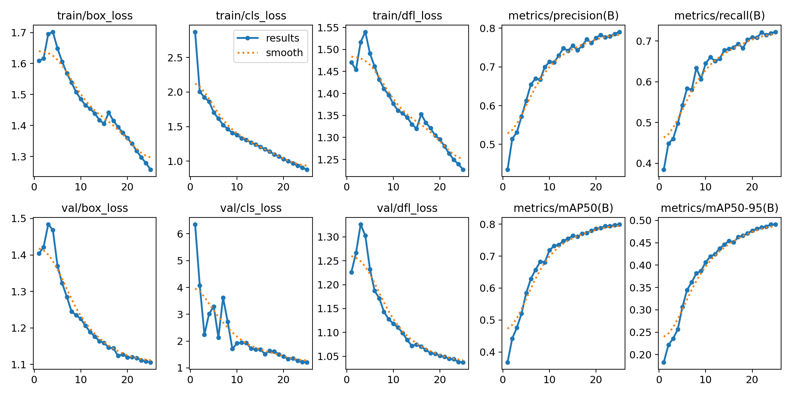
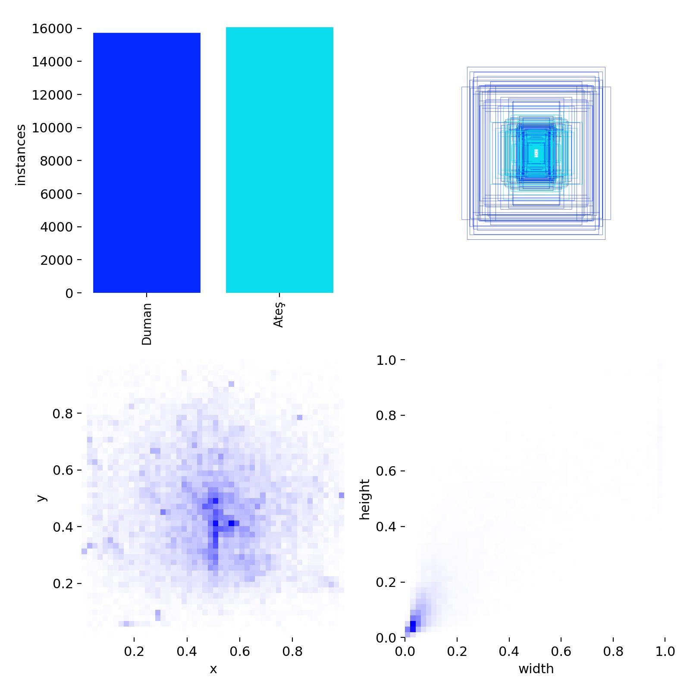

# Fire and Smoke Detection System

<p align="center">
  <b>Real-time computer vision for early fire & smoke detection using YOLO architecture with cloud-based alerting</b>
</p>

<p align="center">
  
  
  
  
  
  
</p>

<p align="center">
  
  
</p>

<p align="center"><i>Real-time detection: <code>Ateş</code> (Fire) and <code>Duman</code> (Smoke) with confidence scores</i></p>

---

## Model Performance

| Metric | YOLOv11n (Primary) | YOLOv8 (Backup) |
|--------|-------------------|-----------------|
| **mAP50** | ~0.80 | ~0.78 |
| **mAP50-95** | ~0.49 | ~0.47 |
| **Precision** | ~0.79 | ~0.76 |
| **Recall** | ~0.72 | ~0.70 |
| **Inference Speed** | ~45-60 FPS | ~35-50 FPS |
| **Model Size** | 2.6 MB | 6.2 MB |

<p align="center">
  
</p>

---

## Dataset Overview

<p align="center">
  
</p>

| Class ID | Turkish Label | English Mapping | Instances |
|----------|--------------|-----------------|-----------|
| 0 | `Ateş` | **Fire** | ~16,000 |
| 1 | `Duman` | **Smoke** | ~16,000 |
| | **Total** | | **~32,000** |

---

## System Architecture

```
┌─────────────────┐     ┌─────────────────┐     ┌─────────────────┐
│   Input Source  │────▶│  YOLOv11n / v8  │────▶│  Detection      │
│  (Video/Image)  │     │  Inference      │     │  Ateş / Duman   │
└─────────────────┘     └─────────────────┘     └────────┬────────┘
                                                         │
                              ┌────────────────────────┘
                              ▼
                    ┌─────────────────┐
                    │  Firebase       │
                    │  Firestore DB   │
                    │  Cloud Logging  │
                    └─────────────────┘
```

---

## Quick Start

### Prerequisites
- Python 3.8+
- Firebase service account key (JSON)

### Installation

```bash
# 1. Clone repository
git clone https://github.com/eminosmanatci/fire-smoke-detection.git
cd fire-smoke-detection

# 2. Install dependencies
pip install -r requirements.txt

# 3. Configure Firebase
# Place your serviceAccountKey.json in project root
# Update the path in firebase.py (line 10)
```

### Usage

```bash
# Run on video file
python detect.py --source samples/test_video1.avi

# Run on webcam (real-time)
python detect.py --source 0

# Run on single image
python detect.py --source samples/test_foto2.jpg
```

---

## Firebase Firestore Integration

Automatic cloud logging triggers on fire/smoke detection:

```json
{
  "timestamp": "2024-01-15T14:32:10.123Z",
  "detection_type": "Ateş (Fire)",
  "confidence": 0.85,
  "source_file": "test_video1.avi",
  "model_version": "yolo11n.pt"
}
```

---

## Project Structure

```
fire-smoke-detection/
├── samples/              # Test images & demo videos
│   ├── test_foto2.jpg
│   ├── test_foto4.jpg
│   ├── test_foto5.jpg
│   ├── test_video1.avi
│   └── test_video2_predicted.mp4
├── datasets/             # Training & validation data
├── runs/                 # Training outputs & metrics
├── detect.py             # Main detection script
├── firebase.py           # Firestore cloud logging module
├── db.py                 # Database operations
├── train.py              # Model training script
├── merge_and_prepare.py  # Data preprocessing pipeline
├── requirements.txt      # Python dependencies
└── data.yaml             # Dataset configuration
```

---

## Tech Stack

| Component | Technology |
|-----------|------------|
| **Object Detection** | YOLOv11n (primary) / YOLOv8 (backup) |
| **Framework** | Ultralytics |
| **Cloud Database** | Firebase Firestore |
| **Language** | Python 3.8+ |
| **Computer Vision** | OpenCV |

---

## Notes on Labels

The model was trained with **Turkish class labels**:
- `Ateş` → **Fire**
- `Duman` → **Smoke**

Detection outputs preserve original Turkish labels for consistency with the training dataset.

---

## Contributing

Contributions are welcome! If you have suggestions or improvements:

1. Fork the repository
2. Create your feature branch (`git checkout -b feature/amazing-feature`)
3. Commit your changes (`git commit -m 'Add amazing feature'`)
4. Push to the branch (`git push origin feature/amazing-feature`)
5. Open a Pull Request

---

## License

This project is licensed under the MIT License - see the [LICENSE](LICENSE) file for details.

---

<p align="center">
  <b>Built with ❤️ for early fire detection & public safety</b>
</p>
